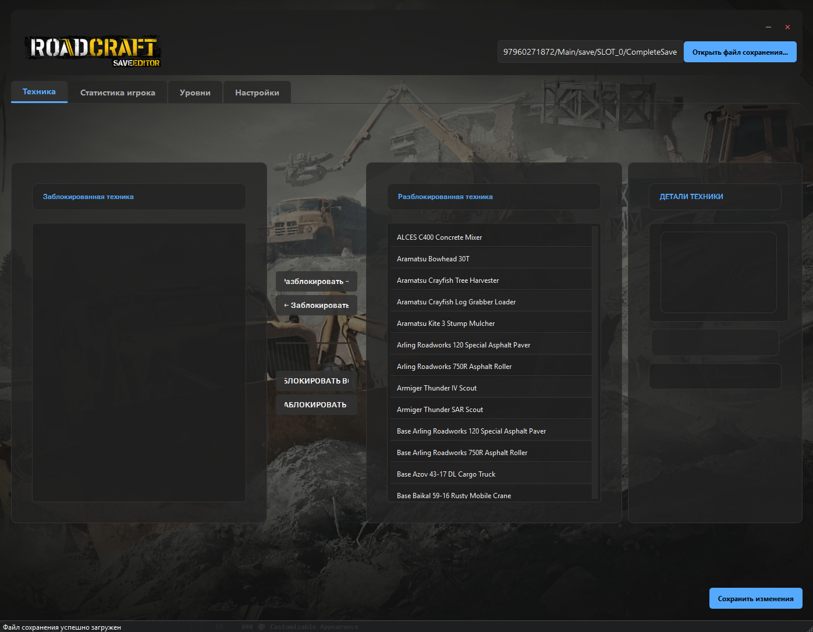
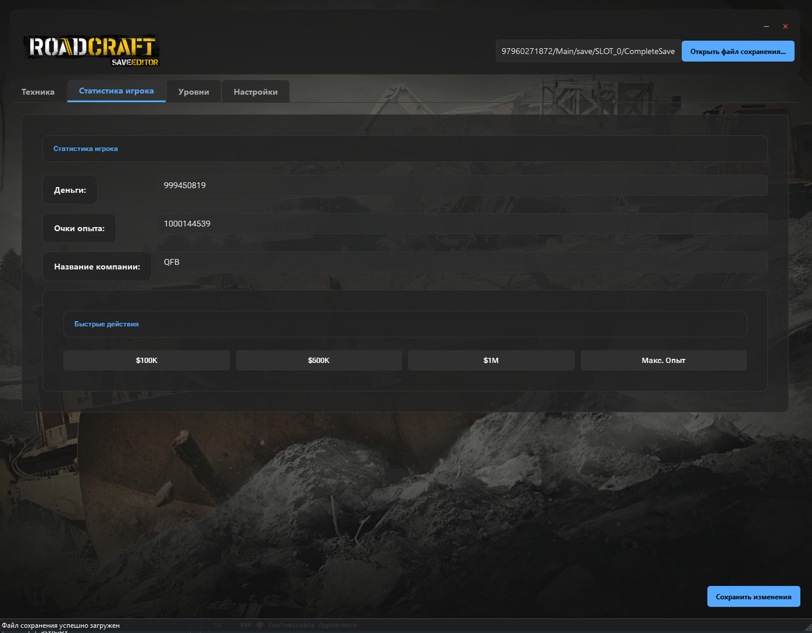
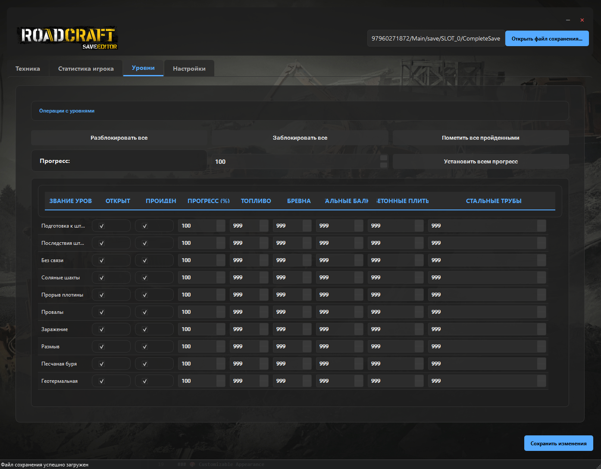
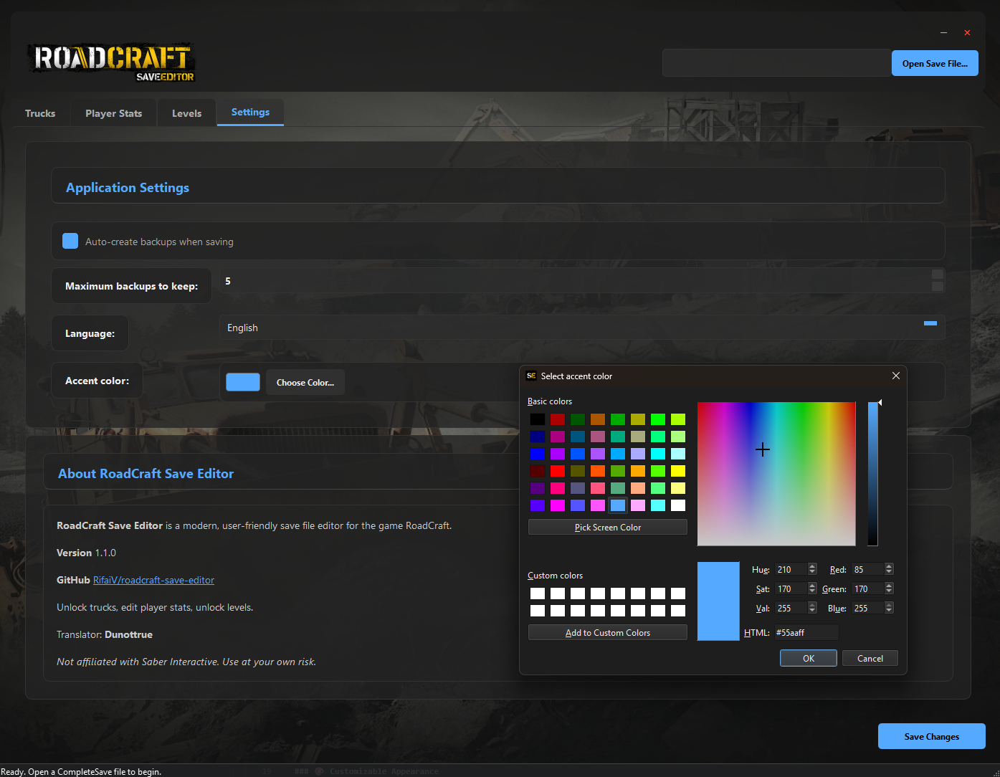

# 🚛 roadcraft save editor

RoadCraft save editor is a modern save file editor for RoadCraft, the infrastructure construction and logistics simulation game by Saber Interactive. Built with PyQt6, this tool allows you to modify your game progress, unlock vehicles and maps, and manage in-game resources. This release features **multilanguage support** (English + Russian with pluggable custom language packs) and **own UI settings** — accent color and bundled Roboto Flex font, fully configurable in-app.

**Current version: 1.2.2**






## ✨ Features

### 🧩 Updated for the RoadCraft Reclaim Expansion
- Added the two Reclaim Expansion maps to the editor (based on the work by [TXC/roadcraft-save-editor](https://github.com/TXC/roadcraft-save-editor)):
  - Autumn Finds (Reclaim Expansion)
  - Summer Drought (Reclaim Expansion)

### 🌍 Multilanguage Support
- Built-in **English** and **Russian** language packs
- Switch languages on the fly in **Settings → Language**
- Easily add your own language: copy any file from the `Lang` folder, translate it and it will appear in the settings automatically
- Custom languages are stored in simple, human-readable JSON files next to the app (`Lang/*.json`)

### 🎨 Customizable Appearance
- Pick any accent color in **Settings → Accent color** — the whole UI restyles instantly
- Color choice is remembered in the app config file (`.roadcraft_editor/config.json` in your user folder)
- UI font: **Roboto Flex** (bundled, no system font required)

### 🚚 Vehicle Management
- Unlock or lock individual trucks
- Bulk unlock/lock all trucks

### 📊 Player Statistics
- Modify in-game currency (money)
- Adjust experience points (XP)
- Change your company name

### 🗺️ Map Management
- Set level completion percentage
- Unlock or mark levels as completed:
  - Storm Preparation
  - Storm Aftermath
  - Incommunicado
  - Salt Mines
  - Dam Break
  - Sinkholes
  - Contamination
  - Washout
  - Sand Storm
  - Geothermal
  - Autumn Finds (Reclaim Expansion)
  - Summer Drought (Reclaim Expansion)
- Edit level-specific resources (logs, steel beams, concrete slabs, steel pipes)
- Modify fuel and recovery coins

### 🛡️ Data Safety & Backups
- Automatic timestamped backups before saving changes

## 💻 Installation

### Option 1: Download Release
1. Grab the latest build from the **Release** folder
2. Run `RoadCraft_SaveEditor_Multilang.exe`

### Option 2: Run from Source

#### Requirements
- Python 3.12+
- PyQt6 (GUI framework)

```bash
# Install dependencies
pip install -r requirements.txt

# Run the editor
python main.py
```

### Option 3: Build Your Own Executable

```bash
# Make sure requirements are installed
pip install -r requirements.txt

# Build executable (output: Release/RoadCraft_SaveEditor_Multilang.exe)
python build_exe.py
```

## 🎮 How to Use

1. **Launch the RoadCraft Save Editor** (either the executable or from source)
2. **Open your save file**:
   - Click the "Open Save File" button
   - Navigate to your RoadCraft save file location:
     - `C:\Users\[YourUsername]\AppData\Local\Saber\RoadCraftGame\storage\steam\user\[SteamID]\Main\save\SLOT_[number]\CompleteSave`
3. **Make your desired changes** to vehicles, resources, or player stats
4. **Save your changes** by clicking the "Save" button
5. **Launch RoadCraft** to see your modifications in-game

## 🌍 Creating Your Own Language File

1. Go to the `Lang` folder next to the executable
2. Copy `en.json` and rename it, e.g. `de.json`
3. Edit `lang_name` / `native_name` (this is how it appears in the language list)
4. Translate the `strings` section
5. Start the editor — your new language now appears in **Settings → Language**

`Lang` files are automatically created next to the executable on first run.

## ⚠️ Usage Notes

- While automatic backups are created, manual backups are still recommended.
- Use at your own risk – modifying game files may affect gameplay or stability.

## 🗂️ Project Structure

```bash
├── main.py              # Application entry point
├── trucks.py            # Truck definitions and logic
├── style.py             # UI styling, fonts and accent-color themes
├── constants.py         # Configuration and constants
├── lang.py              # Language manager (reads Lang/*.json)
├── build_exe.py         # PyInstaller build script
├── version_info.txt     # Windows executable version metadata
├── images/
│   ├── trucks/          # Truck images
│   └── ui/              # UI graphics
├── Lang/                # Translation files (en.json, ru.json, ...)
├── font/                # Bundled Roboto Flex font
├── screenshot/          # Screenshots for documentation
└── README.md            # This file
```

## 💾 Save File Format

- Proprietary RoadCraft format
- 53-byte header with metadata
- Zlib-compressed JSON payload
- MD5 hash for integrity verification
- Timestamped backups created automatically

## 🙏 Credits & Attribution

This project is heavily based on the excellent work from the original:

- Original project: [roadcraft-completesave](https://github.com/NakedDevA/roadcraft-completesave)

Key features adapted:
- Save file decompression/compression logic
- Proprietary format handling
- Base64 and zlib operations

Original GUI project: [RifaiV/roadcraft-save-editor](https://github.com/RifaiV/roadcraft-save-editor)

RoadCraft Reclaim Expansion support (autumn and summer maps): [TXC/roadcraft-save-editor](https://github.com/TXC/roadcraft-save-editor)

- **Russian translation:** Dunottrue

## 🪄 About This Fork

Current home: [dunottrue/roadcraft-save-editor](https://github.com/dunottrue/roadcraft-save-editor) — downloads the latest release from that page.

This is a modern, GUI-based fork offering significant enhancements:

- Full PyQt6 GUI
- Visual truck gallery with images and stats
- Bulk actions for vehicles and maps
- Improved backup and save validation
- Multilanguage support with custom language packs
- Customizable accent color
- Roboto Flex UI font